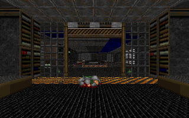

# DOOM on EVM 👹

Original DOOM gameplay and rendering now run inside the local EVM. **Phase 3 M2/M3 is verified**: movement/collisions, weapons, monster AI,
damage, doors and world interactions, with 2,355 native-equivalent gameplay tics,
31 exact frames, complete independent production replay and real Chrome pixels.
The browser submits input and displays EVM Frame pixels.

The frozen Phase 3 acceptance profile is Freedoom E1M1, one player, medium skill and full-screen
world view. This is a readable port of original `linuxdoom-1.10` to Solidity/Yul;
full original DOOM, automatic level progression, menus/HUD/audio and multiplayer
remain outside that historical profile. Episode One functional integration is
documented separately below. See the [Phase 3 report](docs/PHASE3-REPORT.md)
and [feature matrix](docs/PHASE3-FEATURE-MATRIX.md).

## Press start

Prerequisites: Git, Python 3.10+, Node **24.11.0**, and Chrome/Chromium for the browser check. Foundry installation is checksum-pinned for macOS arm64 and Linux amd64/arm64. The native reference gate currently requires Apple clang **17.0.0 (clang-1700.0.13.5)** on **arm64-apple-darwin24.6.0**; other native profiles need review. This run was verified on macOS arm64.

```sh
git submodule update --init --recursive
python3 scripts/install-toolchain.py
export PATH="$PWD/.toolchain/bin:$PATH"
python3 scripts/check-toolchain.py
python3 scripts/verify-phase2.py
```

Tools install under ignored `.toolchain/`; global Foundry is left alone. No npm dependencies are required. Set `CHROME_BIN` if Chrome is not at its standard macOS path. The full verifier downloads and checks the pinned Freedoom archive, builds the original C oracle, preserves every Phase 0 gate, starts and stops temporary localhost nodes and a headless browser, and writes fresh results to `artifacts/local/`. The original `python3 scripts/verify-phase0.py` command remains available.

## Play Episode One

The opt-in Episode application connects all nine Freedoom maps, original gameflow,
Status Bar/HUD, keyboard cheats, Automap, intermission and the E1 ending. This is
functional integration; full episode input replay and exhaustive release
acceptance remain separate. See the [integration report](docs/PHASE4-EPISODE-COMPLETION.md)
for the verified scope and explicit native memory profile.

Prepare the pinned resources and build the production root without running the
historical verification suite:

```sh
source scripts/env.sh
node tools/wad/download.ts artifacts/local/freedoom
node tools/wad/episode-pack.ts pack artifacts/local/freedoom/freedoom1.wad artifacts/local/wad
forge build src/evm/Doom.sol --skip test --skip GameplayProbe --skip RendererProbe --skip WadResourcesProbe --skip EpisodeStartupProbe --skip IntermissionProbe --skip CheatProbe --skip AutomapProbe --skip VideoProbe --skip EpisodeResourcesProbe
node tools/reference/episode_completion/evm.mjs --play --output-prefix artifacts/local/episode-play
```

Open <http://127.0.0.1:18762>, choose E1M1–E1M9 and click **New Game**. WASD moves,
arrows turn, Shift runs, Ctrl fires, Space/E uses doors, and 1–8 select weapons.
Tab opens the Automap; type original cheat codes, including IDCLEV.
Fire or Use advances intermission. **Restart** reloads the current level;
**Pause/Resume** pauses the EVM game. **Stop input** and blur release keyboard
input. The launcher refuses occupied ports and Ctrl-C stops its own Anvil and
HTTP server. All gameplay and game-screen pixels come from the EVM.

## Play the accepted E1M1 mode

After the verifier prepares the resources:

```sh
source scripts/env.sh
python3 tools/reference/gameplay/production.py --output artifacts/local/gameplay-production-native-final
node tools/reference/gameplay/production.mjs --native-zone \
  --native artifacts/local/gameplay-production-native-final \
  --output-prefix artifacts/local/gameplay-production-new --keep-node
cp artifacts/local/gameplay-production-new.config.json web/config.local.json
cp artifacts/local/gameplay-production-new.palette.json web/palette.local.json
node tools/transport/serve.mjs
```

Open <http://127.0.0.1:8080>, click Start, and use arrows/WASD, Ctrl to fire,
Space to use, and Shift to run. Stop or blur releases input. Transactions advance
original simulation tics; 35 tics/s is simulated game time, not an FPS promise.
Serialize writers sharing the same unlocked Anvil sender.

The local execution budget defaults to **10 billion gas** and is configurable
through `execution-budget.json` or `DOOM_GAS_LIMIT`. Actual atomic initialization
uses **1,621,885,757 gas** in the verified profile. Startup stays one transaction;
compiler, code and memory settings are preserved.

## Run the real static view

After the verifier prepares the pinned resources:

```sh
# Terminal 1: deploy, verify, and keep the local node running
node tools/renderer/verify.mjs --keep-alive
# Terminal 2
node tools/transport/serve.mjs
```

Open <http://127.0.0.1:8080> and click **Run DOOM**. Each click renders the static
E1M1 view in a new transaction. Ctrl-C in the first terminal stops its Anvil.
See [the deployment/browser report](docs/PHASE2-E2E.md) for pixels, receipts,
gas, memory, timings and the precise static scope.



## Transport test pattern

```sh
# Terminal 1
./scripts/start-anvil.sh
# Terminal 2
node tools/transport/benchmark.mjs --rpc http://127.0.0.1:8545 --ws ws://127.0.0.1:8545
node tools/transport/serve.mjs
```

Open <http://127.0.0.1:8080>. The moving grayscale pattern is synthetic and generated inside Solidity. It is our transport test, not a Doom screenshot.

For the same mock frame using actual Freedoom colors after running the verifier:

```sh
node tools/transport/benchmark.mjs --rpc http://127.0.0.1:8545 --palette artifacts/local/wad/palette.json
```

Reload the browser. The image is still a transport test, now colored by PLAYPAL.

## Mission briefing

- [Local Codex usage collector and historical article metrics](docs/CODEX-USAGE.md)
- [Phase 3 acceptance report](docs/PHASE3-REPORT.md), [progress ledger](docs/PHASE3-PLAN.md), and [feature coverage](docs/PHASE3-FEATURE-MATRIX.md)
- [Phase 2 acceptance ledger](docs/PHASE2-REPORT.md) and [frozen renderer interfaces](docs/PHASE2-INTERFACES.md)
- [Phase 1 report and acceptance evidence](docs/PHASE1-REPORT.md)
- [Phase 0 report and acceptance evidence](docs/PHASE0-REPORT.md)
- [Toolchain and measured Anvil limits](TOOLCHAIN.md)
- [C → Solidity map and progress](PORTING.md)
- [Phase 1 interfaces](docs/PHASE1-INTERFACES.md), [Phase 0 interfaces](docs/PHASE0-INTERFACES.md), [schemas](docs/SCHEMAS.md)
- [Architecture decisions](docs/01-IDEA-AND-DECISIONS.md), [technical specification](docs/02-TECHNICAL-SPECIFICATION.md), [implementation plan](docs/03-IMPLEMENTATION-PLAN.md)
- [Transport experiment](docs/EVENT-TRANSPORT.md), [stack experiment](docs/STACK-PRESSURE.md)
- [Pinned upstream and attribution](UPSTREAM.md), [GPL-2.0 license](LICENSE)

No proprietary WAD assets are included. Freedoom fixtures carry their own license and checksums; the full WAD stays in ignored local artifacts.
