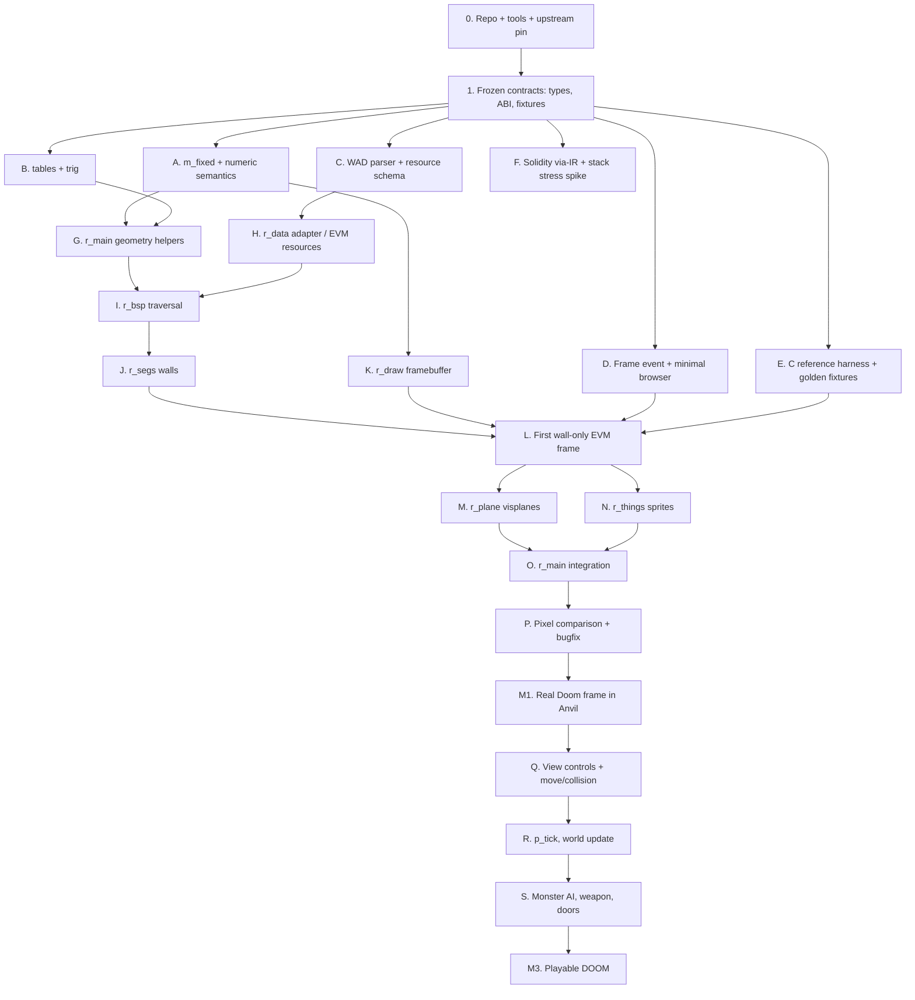

# DOOM on EVM — Implementation Plan and Parallel Agent Work

> **Version:** 0.1 · **Date:** 2026-10-09 · **Audience:** Codex and a team of autonomous coding agents.
>
> Related documents: [01 — idea and decision history](01-IDEA-AND-DECISIONS.md) · [02 — technical specification](02-TECHNICAL-SPECIFICATION.md).

## 0. Instructions for the next Codex session

This is **a plan for work in a real repository**, not a report of completed implementation. Do not assume that `src/`, `tools/`, or `test/` already exist. Start by inspecting the working directory, initializing/adapting the repository, and pinning upstream sources and the toolchain.

**Primary priority:** readable source code and transparent C ↔ Solidity equivalence. The second priority is an early end-to-end experiment: **EVM transaction → Frame event → Canvas**. Parallel agents can only accelerate work if interfaces and test fixtures are agreed upon **before** bulk porting begins.

### Goals of the first Codex session

1. Read all three documents and briefly restate the objective and invariants.
2. Create a minimal Foundry repository, or adapt the existing one without disturbing unrelated changes.
3. Pin the reference DOOM commit; record working `forge`/`anvil`/`solc`/Node versions, EVM hardfork, and CLI commands.
4. Agree on initial **shared interfaces**: numeric types, `RenderState`, WAD fixture format, and Frame ABI.
5. Run two **end-to-end risk spikes**: (a) a 64 KB Frame event and (b) `via_ir` on the shape of a complex renderer function.
6. Then issue independent agent workstreams and begin the `m_fixed.c` port, resource parser, and test infrastructure.

**Do not begin** by asking a single agent to automatically rewrite the entire original DOOM codebase.

## 1. Dependency map



**Key synchronization gates:** after freezing shared contracts; after integrating `WAD ↔ r_data`; after integrating BSP + segs + draw; after full rendering; and after world/game-state integration. Between gates, agents stay within their owned files and exchange data only through frozen interfaces and fixtures.

## 2. Rules for parallel execution

### Ownership and code boundaries

- Assign **non-overlapping file sets** to each agent. `src/evm/Doom.sol`, `src/doom/r_state.sol`, `src/doom/r_defs.sol`, `foundry.toml`, and shared fixture schemas are **shared interfaces** owned by the integrator after the freeze.
- Agents must not change shared types or the ABI without a formal change request. They may keep a private adapter in their owned area while a change request is reviewed.
- Use a PR/branch/separate worktree per agent; the integrator owns merging, cross-module testing, and conflict resolution. If the environment cannot run multiple worktrees/agents, execute the same tasks **sequentially, respecting the same ownership boundaries**.
- Agents must not “improve the architecture” by moving `R_StoreWallRange` to a module that does not match its original C definition or by renaming functions.
- Every agent may read any file, but may write **only** assigned paths, its own tests, and documentation within its allocated area.
- A modification to an original C algorithm requires evidence of equivalence—not a subjective simplification.

### Single integrator/orchestrator

The integrator is responsible for:

1. `UPSTREAM.md`, upstream pinning, Foundry config, `src/evm/Doom.sol`, and shared state structs/interfaces.
2. Task decomposition and distribution of immutable fixture/schema IDs.
3. CI/local builds, cherry-picks/merges, and tests across integrated modules.
4. Source-fidelity review and Yul/memory-safety policy enforcement.
5. Approval of architectural deviations and updates to `PORTING.md` and this plan.

### Agent delivery contract

Each PR must include:

```text
Module: <original file> -> <new .sol file>
Upstream SHA: <sha>
Public/internal functions ported: <names>
Files touched: <paths>
C comparison: <command + result>
Forge tests: <command + result>
Known deviations: <list with reason>
Assembly usage: <memory-safe proof or None>
Open integration questions: <max 3, actionable>
```

Do not accept a PR that merely says “everything works” without reproducible tests.

## 3. Phase 0 — bootstrap before parallel implementation

### Task 0.1 — repository inventory/setup (integrator)

**Actions**

- Inspect the working directory and Git status; do not overwrite existing work.
- Agree on the repository name `doom-evm` (or retain the existing name), configure `forge init`/`foundry.toml`, and build a minimal skeleton.
- Add the original id Software DOOM as a submodule at a pinned SHA. Record date, SHA, and license in `UPSTREAM.md`.
- Record exact tool versions and command-line parameters in `TOOLCHAIN.md` or scripts. Check that the installed `anvil --help` supports the chosen flags.
- Enable `via_ir = true` and pin `evm_version` and `solc_version` **after** a smoke build.

**DoD:** `forge build` and `forge test` succeed on the starter project; reproducible `scripts/start-anvil.sh` exists, and `UPSTREAM.md` records the exact SHA.

### Task 0.2 — frozen shared contracts (integrator, with short agent review)

Freeze the following:

| Interface | Minimum contract |
|---|---|
| Numeric ABI | `fixed_t`→`int32`; `angle_t`→`uint32`; signed shifts and array-index sentinels |
| Render context | `RenderState memory`, framebuffer bytes, view geometry, initial width/height |
| Game context | Initially minimal `DoomState storage`; declare the intended extension strategy |
| Resource bundle | Deterministic schema version, WAD SHA, little-endian normalization, lump identifiers |
| Frame protocol | `Frame(frameId,inputSeq,width,height,bytes pixels)`; row-major indexed8; palette source |
| Reference fixture | Canonical coordinate types, hashes, golden pixel-buffer metadata |
| Testing | Exactly what C comparisons cover, accepted deviations, and who approves them |

**DoD:** not just a written agreement—compilable scaffold types/interfaces and JSON schema/example fixtures; optional test stubs. All post-freeze changes go through the integrator.

### Task 0.3 — two risk spikes (parallel, in separate files)

**EventTransport spike:** write a small contract that generates 64,000 bytes and `emit Frame`; build a minimal WebSocket subscriber plus receipt fallback that retrieves the complete payload. **Measure:** gas, transaction execution/mining time, WS delivery latency, and heap/process memory. Verify the actual gas configuration; do not draw conclusions without command output.

**StackPressure spike:** reproduce the *shape* of `R_StoreWallRange()` from `r_segs.c`: many locals, conditions, and computations with dependency stubs. Compile with `via_ir` and the actual pinned solc. If `Stack too deep` occurs, try local fixes: a scratch `memory` struct, memory-safe Yul constraints, and helpers split within the original file. **Do not call this spike a port of `r_segs`.**

**DoD:** reproducible commands, measurements, and a documented decision on whether compiler/runtime settings should change. Perfect performance is not required.

## 4. Phase 1 — parallel foundation work

**After the interface freeze**, launch five independent agents if capacity permits.

| Agent | Task | Ownership | Input contract | Output / DoD |
|---|---|---|---|---|
| A — Numeric | `m_fixed.c → m_fixed.sol` | `src/doom/m_fixed.sol`, `test/unit/m_fixed.t.sol` | Numeric ABI | `FixedMul/FixedDiv/FixedDiv2` and needed helpers; exact C vectors and documented divergences |
| B — Tables | `tables.c → tables.sol` | `src/doom/tables.sol`, `test/unit/tables.t.sol` | Table schema + numeric types | Consistent trigonometric lookups, checksums, documented generation/static data |
| C — Assets | WAD parser + packer | `tools/wad/**`, `test/fixtures/wad/**` | Resource schema | Reproducible parsing of a permitted IWAD, checksum/lump-bounds tests, no per-frame precomputation |
| D — Transport | Frame event benchmark + frontend | `web/**`, `test/integration/FrameEvent.t.sol`, `src/support/FrameFixture.sol` | Frame ABI + mock publisher | Tx→receipt/WS→Canvas; log deduplication, ordered frames, no 3D in JS |
| E — Reference | C harness + diff tools | `tools/reference/**`, `test/fixtures/reference/**` | Fixture JSON schema | Deterministic native numeric/BSP vectors and camera-test configuration |

**Agent D must not create or edit `src/evm/Doom.sol`:** the integrator owns that adapter; Agent D uses a mock/harness. This avoids conflicts when the actual engine is integrated.

**Phase 1 integration gate:** every module compiles under one pinned solc version; all fixtures identify WAD/upstream SHAs; browser displays a **mock-generated** Frame event; numeric code passes comparison with the C reference.

## 5. Phase 2 — genuine renderer, sequenced by dependencies

### Batch 2A — partially parallelizable

| Agent | Workstream | File ownership | Prerequisite |
|---|---|---|---|
| F — Geometry | `r_main.c` geometry helpers (`R_PointOnSide`, `R_PointToAngle2`, setup subset) | `src/doom/r_main.sol`, tests | A Numeric + B Tables |
| G — Resource access | `r_data.c` data adapter, layouts for map/texture access | `src/doom/r_data.sol`, tests | C WAD + resource schema |
| H — Frame primitives | `r_draw.c`, column/span writes and buffer operations | `src/doom/r_draw.sol`, tests | Shared `RenderState`; palette-lookup contract |

**DoD:** geometry fixtures match the C reference; resource addressing/lookups are tested; `r_draw` generates deterministic indexed8 columns, including bounds-checking tests. Original `R_...` functions remain in their corresponding source files.

### Batch 2B — BSP

| Agent | Workstream | Prerequisite | Acceptance |
|---|---|---|---|
| I — BSP | `r_bsp.c → r_bsp.sol` | F Geometry + G Resource access | Traversal and clipping agree for selected scenes, including front/back and `NF_SUBSECTOR` |
| J — Segments | `r_segs.c → r_segs.sol` | I BSP + H Draw | Textured walls and visible columns; comparison against C traces/pixels |

**Caution:** `r_bsp` calls `r_segs` functions, and `r_segs` may read shared types. Prevent circular imports using an agreed `R_Main` integration layer/internal orchestration. The first BSP version can be tested against a trace/mock interface without a segment renderer, then integrated with J.

### Integration gate 2B — first wall-only frame

The integrator connects BSP + Segs + Draw + resources + mock/real Frame emitter. Render at least one fixed viewpoint on the selected WAD. **Do not describe this as the completed DOOM renderer** before floors, ceilings, and masked sprites are implemented. Record an exact pixel diff against the C reference for the current scope.

### Batch 2C — after the wall pipeline works

| Agent | Workstream | Prerequisite | Acceptance |
|---|---|---|---|
| K — Planes | `r_plane.c → r_plane.sol` | Resource access + geometry + frame drawing | Floor/ceiling visplanes, clipping, colormaps, C comparison |
| L — Sprites | `r_things.c → r_things.sol` | Resource access + frame drawing + BSP output | Masked sprites, sorting/clipping, C comparison |
| M — Main integration | `r_main.sol` `R_RenderPlayerView()` orchestration + `Doom.sol` glue | K + L (integrator) | Complete render sequence; consistent framebuffer and Frame event |

**K and L can run in parallel** after `RenderState` has stable buffers and agreed interfaces for masked columns/visplanes. Tests for each workstream should remain isolated.

### M1 gate — real DOOM rendering in Anvil

- [ ] The Frame event contains pixels computed by genuine Doom algorithms in Solidity/Yul (BSP/segs/planes/sprites—or an explicitly documented partial scope).
- [ ] Real WAD resource pipeline, reproducible SHA, no precomputed player-specific visibility outside the EVM.
- [ ] `forge test` and an end-to-end script pass against pinned Anvil.
- [ ] A reference screenshot/golden diff and a technical divergence report are available.
- [ ] Browser displays pixels from a transaction event rather than rendering the 3D scene itself.
- [ ] Renderer functions in the Solidity source can be traced back to their original C definitions.

For a **complete static M1 frame**, implement planes and sprites whenever they appear in the test viewpoint. A partial frame can be published as an intermediate milestone, but it must not be labeled full M1.

## 6. Phase 3 — playable DOOM (after M1)

Plan this phase in greater detail after the first real render: game-state structures may be significantly more expensive or complicated than expected.

### Batch 3A — gameplay and input dependencies

1. **Input mapping:** browser samples keyboard state and turns it into a `ticcmd_t`-like command packet; define repeat handling and `inputSeq`. All movement semantics execute inside the EVM.
2. **`p_user`/movement and `p_map`/collision:** port into matching `.sol` files; compare movement and collision traces against C.
3. **`p_tick`/thinkers:** deterministic update list and RNG state. The original **35 tics/s** define simulated game time, **not** a target FPS.
4. **World mutation:** doors, sector state, switch interactions; changes persist in `storage`, and the frame uses state after the tick.
5. **Demo:** a sequence of transactions correctly updates the viewpoint; map movement and collisions match the C reference.

**Parallel batches:** input/browser work and C reference traces are independent. Player movement and thinker/storage layout can proceed in parallel **only after** game-state types are frozen. `p_tick` and AI depend on a consistent entity model.

### Batch 3B — mechanics

Once the engine-state model is frozen, parallelize:

- Actor/`mobj` lifecycle and collisions.
- Player weapons / `p_pspr`.
- Monster AI / `p_enemy`.
- Sector special actions, doors, and lifts.
- Game loop and scenario tests.

The integrator combines these and records reproducible **input sequence → frame hashes / tic traces**.

### M2 / M3 gates

**M2:** inputs `forward/back/strafe/turn/use` move the player correctly through a real level; Solidity computes collisions and camera position; frame sequences are reproducible.

**M3:** weapons/shooting, monsters with AI, damage, doors, and interactions work. Do not claim the *complete original DOOM* without a feature-coverage matrix.

## 7. Agent task briefs — ready for Codex

These standardized briefs can be issued by the integrator together with the pinned upstream SHA and the frozen interface definitions.

### Brief A: numeric port

> Port `linuxdoom-1.10/m_fixed.c` into `src/doom/m_fixed.sol`. Preserve original function names and documented edge-case behavior. Use frozen `fixed_t=int32` numeric conventions, `via_ir`, and keep any `unchecked`/Yul deviations explicit. Add Foundry tests using deterministic vectors generated by the original C harness; cover negative values, saturation/division, shifts, and overflow boundaries. Work ONLY in your owned source and tests. Do not modify common schemas or `Doom.sol`. Finish with test commands and a function-by-function C mapping.

### Brief B: tables

> Port `tables.c` and related numeric table definitions to `tables.sol` under the frozen table interface. Record table generation/source and checksums; preserve name relationships (`finesine`, `finecosine`, `tantoangle`, etc.). Verify indexing/rounding against upstream C reference. Do not change shared numeric types.

### Brief C: WAD tooling

> Implement deterministic TypeScript tooling that parses a legally redistributable Doom-compatible IWAD (prefer Freedoom Phase 1), validates lumps, records SHA-256, and emits the frozen resource schema. Static texture assembly is allowed; view-specific visibility/rendering is forbidden. Add tests for malformed offsets, negative/out-of-bounds indices, endianness, and a snapshot of selected lumps. No browser rendering and no smart-contract interface changes.

### Brief D: event transport

> Implement a minimal browser client for the frozen `Frame` ABI that subscribes to Anvil WS logs, uses transaction receipts as a fallback, deduplicates and orders frames, decodes palette indexes to Canvas, and submits sequential input transactions. Use a mock Frame emitter; never implement BSP/raycasting/3D rendering in JavaScript. Add a 64 KB payload test and measured latency/gas. Do not edit integration `Doom.sol`, which is owned by the orchestrator.

### Brief E: C reference oracle

> Build a native reference harness pinned to the original DOOM SHA. Produce versioned, machine-readable numeric and geometry vectors, and eventually framebuffer goldens containing the exact WAD SHA and camera settings. Document build patches and compiler differences; do not silently substitute Chocolate Doom for the original. Export fixture metadata and reproducibility commands; avoid non-redistributable original WAD assets.

### Brief F: stack-pressure spike

> Investigate `via_ir` stack pressure using a faithful approximation of the structure of original `R_StoreWallRange`, with other engine calls stubbed. **Do not** claim the stub is a functional DOOM port. Record compiler version, build commands, and stack/deployment/memory errors. Propose the smallest deviations that compile. Do not merge helper code into core renderer files without agreement from their owner and the integrator.

### Brief I/J/K/L: renderer port

> Port the assigned original renderer `.c` file into a same-named `.sol` library. Preserve names/control flow and file ownership; do not introduce a replacement high-level rendering algorithm. Use frozen `RenderState` and WAD schemas. Compare meaningful intermediate traces against the C oracle before comparing pixel goldens. Use Yul only locally with documented memory safety; classify all deviations. Deliver `forge` tests, benchmarks, and a C→Solidity function mapping.

## 8. Integration and merge protocol

### Before starting work

- Ensure `git status --short` is clean, or protect existing modifications. Each agent uses a separate branch/worktree.
- Read documents `01`, `02`, this document, `UPSTREAM.md`, latest `PORTING.md`, and the frozen schemas.
- Record the assigned files, upstream SHA, and expected artifacts.

### Merge checklist

1. Review changed files; reject edits to another agent's owned files or shared ABI without approval.
2. Run `forge fmt --check` (or the project's selected formatter), `forge build`, and `forge test`.
3. Run module-specific C comparisons and verify fixture checksums.
4. Review C and Solidity functions side by side; detect missing or substituted algorithms.
5. Audit Yul memory safety, overflow semantics, stack workarounds, hidden JS renderers, and view-dependent precomputed data.
6. Validate the `Doom.sol` adapter: **exactly one Frame event for every successful `stepAndRender`**.
7. Update the `PORTING.md` mapping and known deviations; merge only when tests pass.

### Regression policy

A faster renderer that changes pixels without documented justification **is not automatically better**. Gas, execution time, and source fidelity are separate metrics. For initial milestones, prioritize deterministic correctness and transparent differences.

## 9. Risk register and early experiments

| Risk | Probability / impact | Early test | Contingency |
|---|---|---|---|
| `Stack too deep` / deep recursion | High / medium-high | via-IR test shaped like `R_StoreWallRange`; deep BSP fixture | Memory scratch struct, helper split in same module, explicit memory traversal stack |
| Contract deployment size / initcode | High / medium | Deploy representative module stubs | Relaxed Anvil limits, linked EVM libraries, or documented local `anvil_setCode` |
| Gas/latency of 64 KB Frame log | Medium / high | 64 KB emit benchmark + WS decode | Lower resolution while developing; chunk only if measurements justify it |
| WAD-to-Solidity memory/storage bottleneck | High / high | Static bundle upload and read benchmark | Immutable resource contracts / `EXTCODECOPY`, incremental loading |
| C integer / fixed-point divergence | High / high | Original C vectors, including signed integer boundaries | Explicit wrapping and reference semantics; document non-identical behavior |
| Pixel differences caused by render settings | High / medium | Identical WAD, camera, colormap, and detail settings | Golden metadata; compare intermediate results first |
| Import cycles / inlined-library size | Medium / medium | Build dependency skeleton before renderer implementation | Top-level orchestration, stable header structs, external EVM modules |
| Missing/out-of-order WS events | Medium / low | Interrupt and reconnect WS while emitting frames | Receipt fallback, `eth_getLogs` backfill, `inputSeq`/`frameId` |
| Asset licensing or copyright problems | Medium / high | Review licenses and WAD provenance during bootstrap | Use Freedoom; never redistribute proprietary WADs |
| Conflicts between parallel agents | High / medium | Frozen schemas and file ownership | Smaller PRs; integrate at fixed gates |
| False success: JavaScript implements a raycaster | Medium / critical | Trace the dataflow from EVM Frame bytes to Canvas | Tests demonstrate no scene geometry/rendering in the browser |

## 10. Backlog by release

### Foundation / Sprint F0 (finish before substantial parallel work)

- [x] `F0-01` Audit/create repository and pin original DOOM commit SHA.
- [x] `F0-02` Reproducible Foundry + Anvil setup, `via_ir`, exact compiler.
- [x] `F0-03` Freeze importable common numeric/render/resource/frame schemas.
- [x] `F0-04` Prove a 64 KB Frame log from a real transaction and decode it in the browser.
- [x] `F0-05` Compile a stack-heavy, renderer-shaped spike.
- [x] `F0-06` Publish `PORTING.md` progress matrix and fixture metadata format.

**Phase 0 verified 2026-10-09:** see [acceptance report](PHASE0-REPORT.md). Phase 1 subsequently verified: see [Phase 1 report](PHASE1-REPORT.md). Phase 2 remains unstarted.

### Foundation / Sprint F1 (parallel agents)

- [x] `F1-A` `m_fixed.sol` and C-oracle tests.
- [x] `F1-B` `tables.sol` and checksum tests.
- [x] `F1-C` WAD loader and deterministic resource package.
- [x] `F1-D` WebSocket + receipt minimal browser and palette decoder.
- [x] `F1-E` Original C harness and reproducible golden infrastructure.

### Renderer / Sprint R1

- [ ] `R1-A` Geometry subset of `r_main.sol`.
- [ ] `R1-B` `r_data.sol` and resource access inside the EVM.
- [ ] `R1-C` `r_draw.sol` framebuffer primitives.
- [ ] `R1-D` `r_bsp.sol` traversal/clipping, C trace comparison.
- [ ] `R1-E` `r_segs.sol` walls and texture coordinates.
- [ ] `R1-F` Integrate BSP→segs→draw→event; reproduce a wall-only frame.

### Renderer / Sprint R2

- [ ] `R2-A` `r_plane.sol` visplanes, floors, and ceilings.
- [ ] `R2-B` `r_things.sol` sprites and masked columns.
- [ ] `R2-C` `r_main.sol` player-view integration; `r_sky` as required.
- [ ] `R2-D` Pixel-golden comparisons and deviation audit.
- [ ] `R2-E` Full static Doom frame end-to-end; M1 report.

### Gameplay / Sprint G1+

- [ ] `G1-A` Input protocol and camera movement.
- [ ] `G1-B` Collisions and movement across the map.
- [ ] `G1-C` Deterministic tic/thinker architecture.
- [ ] `G1-D` Interactions and sprites tied to entity state.
- [ ] `G1-E` Weapons, AI, doors, and completion criteria.

**Here, “Sprint” denotes a block of logical dependencies, not a time estimate.** Do not invent calendar deadlines before measuring real progress.

## 11. Progress reporting protocol

After every integration gate, update this table:

| Milestone | Status | Evidence | Divergences | Blockers |
|---|---|---|---|---|
| Event smoke | passed | [Phase 0 report](PHASE0-REPORT.md), real receipt/WS/Canvas verification | Synthetic fixture only; no DOOM renderer | None |
| C fixed math | passed | [Phase 1 report](PHASE1-REPORT.md), original C vectors and full table comparisons | Explicit undefined-C extensions | None |
| WAD data in EVM (foundation samples) | passed | [Phase 1 report](PHASE1-REPORT.md), actual WAD upload/read hashes | Samples only; runtime renderer adapter remains Phase 2 | None for Phase 1 |
| BSP walls render | not started | — | — | — |
| M1 full static frame | not started | — | — | — |
| M2 movement | not started | — | — | — |
| M3 basic gameplay | not started | — | — | — |

`Status` ∈ {not started, in progress, blocked, passed}. `Evidence` means a specific commit, reproducible command, screenshot diff, or log hash—not a subjective assertion.

## 12. First concrete step in Codex

**Recommended prompt for the new Codex session:**

> Read `docs/01-IDEA-AND-DECISIONS.md`, `docs/02-TECHNICAL-SPECIFICATION.md`, and `docs/03-IMPLEMENTATION-PLAN.md`. This is `doom-evm`: a faithful port of the original DOOM to Solidity/Yul, with a renderer executing in Anvil, Frame-event transport, and C→Solidity file mapping. Do not change agreed architecture without justification and approval. Begin with Phase 0: inspect the repository, pin the upstream SHA and toolchain, build a minimal compilable skeleton, freeze shared interfaces, and run two measured spikes (64 KB Frame log and via-IR stack pressure). Then propose specific non-overlapping tasks for parallel agents with file ownership and DoD. Do not claim source files or tests exist before verifying them.

**Once Phase 0 is complete:** the integrator launches A/B/C/D/E in parallel, integrates their results, and then assigns renderer work according to the dependency diagram.

## 13. Sources and supporting documentation

- [id-Software/DOOM — upstream](https://github.com/id-Software/DOOM/tree/master/linuxdoom-1.10)
- [DOOM `FILES2` — historical file categories](https://github.com/id-Software/DOOM/blob/master/linuxdoom-1.10/FILES2)
- [Foundry compiler configuration](https://getfoundry.sh/reference/config/solidity-compiler)
- [Anvil CLI reference snapshot](https://github.com/hbs/foundry-book/blob/master/src/reference/cli/anvil.md) — verify against installed version
- [Solidity memory-safe assembly](https://docs.soliditylang.org/en/latest/assembly.html#memory-safety)
- [Ethereum JSON-RPC](https://ethereum.org/developers/docs/apis/json-rpc/)
- [Freedoom project](https://github.com/freedoom/freedoom)
