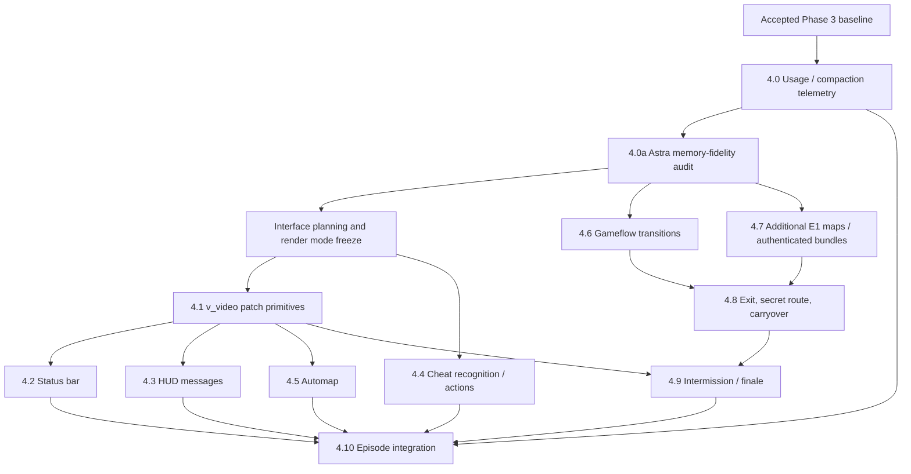

# DOOM on EVM — Implementation Plan Extra: Phase 4

> **Status:** proposed scope and execution plan; not an implementation claim.
> **Date:** 2026-10-10.
> **Audience:** Codex integrator and bounded autonomous subagents.
> **Repository:** https://github.com/ediskandarov/doom-evm
> **Companion:** `docs/03-IMPLEMENTATION-PLAN.md` (Phases 0–3), `docs/PHASE3-REPORT.md`, `docs/PHASE3-FEATURE-MATRIX.md`, `PORTING.md`.
>
> **Document placement:** save this file as `docs/03-IMPLEMENTATION-PLAN-EXTRA.md`. Do not overwrite the original implementation plan or revise accepted Phase 0–3 claims.

## 0. Decision record and success boundary

**Phase 3 is accepted.** The verified baseline has the original DOOM gameplay and software renderer running inside local Anvil/EVM, with M2 movement and M3 basic gameplay accepted for a bounded Freedoom E1M1 profile. Phase 4 is **optional feature completion**, not a prerequisite for saying “DOOM runs on EVM.”

**Phase 4 product goal:** Play through **the complete first episode** using compatible, legally redistributable Freedoom resources: E1M1 through E1M8, with the canonical secret path E1M3 → E1M9 → E1M4. Provide original-style **status bar (including Doomguy face), HUD messages, automap, cheat codes, gameflow, intermissions and episode ending**. Preserve the original engine's source-level traceability and use EVM-rendered pixels for every visual element.

**Acceptance claim when done:** “DOOM Episode One gameplay, UI and level progression run inside a local EVM in a verified single-player profile.” Do **not** claim a feature-complete original DOOM port, arbitrary-WAD support, or game-wide pixel equivalence outside demonstrated fixtures.

### Explicit inclusions

- Bottom status bar, numbers, arms/ammo/health/armor/keys, face logic, red/gold/radiation palettes where applicable; original-style 320×200 view with 320×168 world area when status bar is active.
- Player HUD messages using original WAD font assets and original message/state rules where relevant.
- Original automap with discovery flags, player marker, pan/zoom/follow, and the `IDDT` stages.
- Original single-player DOOM 1 cheat handling relevant to this episode: `IDDQD`, `IDKFA`, `IDFA`, `IDSPISPOPD`, `IDBEHOLD*`, `IDCHOPPERS`, `IDMYPOS`, `IDCLEVxy`, `IDDT`; confirm actual original semantics and legal episode/level parameters from the pinned C source. Do not promise `IDCLIP` as a required DOOM 1 cheat (it is associated with DOOM II variants). No music cheat, `IDMUS`.
- New game, pause, death/restart/reborn, normal and secret exits, retained player/inventory transitions as in original C, intermission statistics, all nine E1 map resources, and episode-ending screen/state.
- Keyboard-only control via the existing browser → transaction → EVM pipeline; no gameplay calculations or cheats implemented in the browser.
- Separate reproducible native-C oracle and Foundry/EVM/Chrome proofs for new features. Existing Phase 3 tests and behaviors must remain valid.

### Explicit exclusions / non-goals

- **ALL audio and music output**. No playback, synthesis, mixing, MIDI/MUS decoding, or audio device APIs. Retain gameplay-side sound-alert/PRNG side effects that affect AI or deterministic equivalence (`P_NoiseAlert`, relevant random draws).
- Browser/WASM EVM, hosted EVM, Mainnet/L2 deployment, wallet integration, or an EVM fork/custom precompile.
- Multiplayer, network chat, joystick/mouse support, demo record/playback, original save-file compatibility.
- Full original menu system, DOS command line, setup utility, general-purpose game launcher, or multi-episode game selection. A **minimal browser Start/Restart/Pause** interface is permitted; original in-game HUD graphics still originate from Solidity.
- DOOM II, episodes 2–4, community PWADs, arbitrary WADs/skills/modes, or comprehensive map compatibility. Keep clear extension points, but **do not silently expand scope**.
- Gas optimization, minimum FPS or guaranteed realtime performance. Measure gas, EVM-memory checkpoints, compilation time and latency without prioritizing those over fidelity. Gas budget remains configurable (default 10 billion; higher only if a reproducible test justifies it).
- An isolated refactor of working Phase 0–3 modules or wholesale rewriting of Python tooling into Node.js.
- Model comparisons or artificial Astra/Sol benchmarks. **Goal 4.0a is an independent GPT-6 Astra technical review, not a benchmark or invitation to rerun Phase 3.**

## 1. Verified baseline — do not regress

The source of truth is the **actual checked-out accepted Phase 3 commit and its acceptance certificate**. Inspect current HEAD and clean working tree; do not assume the documented verification hash is HEAD if documentation was published afterward. Preserve a tag/branch for the accepted baseline.

Evidence from Phase 3 (not Phase 4):

| Baseline evidence | Accepted scope |
|---|---|
| Original engine → EVM | 2,355 native-equivalent gameplay tics; 31 exact indexed-8 frames; 9 native state snapshots in defined E1M1 scenarios |
| Production + browser | 129 keyboard packets; six real Chrome frames and byte-exact Canvas output; 13 rejection/storage-rollback checks |
| Test gates | 403 Foundry tests / 40 suites and all inherited Phase 0–2 gates |
| Resources | Authenticated Freedoom 0.13.0 E1M1, immutable resource chunk strategy, one atomic game initialization |
| Measured gas | Startup 1,621,885,757; selected render tics 719,455,170–781,684,253 gas |
| Compiler + EVM | Solc 0.8.37; via-IR optimizer=200; Cancun; relaxed local Anvil; configurable 10B gas transaction budget |

These numbers are **historical baseline**, not Phase 4 acceptance evidence. Do not weaken or skip inherited checks. New UI and multi-map fixture profiles can be additional suites; do not mutate existing goldens to fit the new behavior.

## 2. Work estimate and uncertainty

Historical elapsed `/goal` windows (not summed child-agent CPU time; not human preparation time): Phase 0 ≈ 42 minutes; Phase 1 ≈ 35 minutes; Phase 2 ≈ 2 h 4 min; Phase 3 ≈ 7 h 3 min; **Phases 0–3 ≈ 10 h 23 min total**.

**Original Phase 4 planning estimate (before the newly requested audit): ~25 hours total elapsed goal time; plausible band 17–38 hours; adverse tail 50+ hours.** Preserve this original forecast for later calibration. **Goal 4.0a (Astra memory review) adds an estimated 1–3 hours of separate effort**; do not silently treat it as included in the original prediction. This is an engineering forecast, not a deadline, and depends heavily on additional maps and C-reference/asset validation. With parallel tasks, individual goal durations are not additive in a strict wall-clock sense. Keep the forecast unchanged for later calibration; record actual goal starts/ends.

| Goal | Work package | Rough isolated effort | Risk |
|---|---|---:|---|
| 4.0 | Compaction and approvals telemetry | 0.5–1.5 h | Low–medium (log schema) |
| **4.0a** | **Independent Astra audit of Phase 3 memory fidelity (read-only)** | **1–3 h** | **Medium (subtle C memory semantics)** |
| 4.1 | Original video patches / drawing boundary | 1–3 h | Medium |
| 4.2 | Status bar + face + palette effects | 2–5 h | Medium–high |
| 4.3 | HUD messages and text widgets | 1–3 h | Medium |
| 4.4 | Cheat codes and input sequence semantics | 1–2 h | Medium |
| 4.5 | Automap | 2–5 h | High |
| 4.6 | Gameflow, pause/rebirth/exit dispatch | 2–5 h | High |
| 4.7 | Multi-map resource support and E1M1–E1M9 startup | 4–9 h | **Very high** |
| 4.8 | Normal/secret transitions + player carryover | 2–5 h | High |
| 4.9 | Intermission and episode finale | 2–5 h | High |
| 4.10 | Cross-feature end-to-end episode acceptance | 3–7 h | **Very high** |

These **task estimates overlap and are deliberately wider than the overall elapsed forecast**; they include uncertainty and are not meant to sum mechanically. Re-estimate after the first multi-map gate, without retroactively changing the initial forecast.

### Primary schedule risks

1. **Unseen map-specific behavior.** Phase 3 production is E1M1-only. E1M2–E1M9 may expose resource, geometry, memory-layout or gameflow differences, including E1M8 finale rules.
2. **UI rendering fidelity.** Palette changes, original WAD patch layout, face timing and FPS-independent frame history may add persistence and native-oracle work.
3. **Full-build time.** Phase 3 recorded an approximately 498-second integrated compile; several runs took longer. Avoid triggering full multi-root rebuilds for each small change.
4. **Frame/event protocol.** Status bar/palette/automap/intermission modes must still yield authenticated, correctly ordered frames. Palette changes may need a versioned presentation metadata/event scheme; do not silently break existing `Frame` consumers.
5. **Cross-transaction state.** Preserve both original gameflow state and renderer global/cache side effects, including source-derived zone allocator behavior where relevant.

## 3. Agent operating rules: shorter goals, no accidental compaction

**Phase != Goal.** Phase 4 consists of individually accepted `/goal` runs. Each goal should deliver one **small, testable integration slice**, not an entire UI/gameflow system. If context pressure rises or a workstream fans out, close a truthful checkpoint and divide the next task rather than continuing a monolithic agent context.

Required behavior of the integrator:

1. At goal start: verify working tree and Phase 3 baseline; identify owned files, dependencies, exact verification command(s), stop condition, and anticipated shared-interface changes.
2. At interface gate: freeze/import compilable APIs and fixture metadata *before* parallel workers write their modules.
3. For subagents: separate worktrees or nonoverlapping ownership; only integrator edits shared state/types, `src/evm/Doom.sol`, browser protocol, common acceptance runner, or shared WAD schema.
4. At verified checkpoint: update `docs/PHASE4-PLAN.md` with **implementation status separate from verification/acceptance status**, evidence, hashes, current blocker, and next action; make focused commits. Record acceptance only after real tests.
5. On goal completion: write a short recoverable handoff in the ledger; commit and push verified work if authorized; leave the tree clean or explicitly report uncommitted work. Record start/end timestamps and model/agent usage attribution.
6. Do not make compaction avoidance an excuse to omit necessary native/Forge checks. Prefer a new goal after a verified checkpoint, retaining continuity in Git and brief report artifacts.
7. Preserve source fidelity: original `v_video.c→v_video.sol`, `st_stuff.c→st_stuff.sol`, `st_lib.c→st_lib.sol`, `hu_stuff.c→hu_stuff.sol`, `hu_lib.c→hu_lib.sol`, `am_map.c→am_map.sol`, `m_cheat.c→m_cheat.sol`, `g_game.c→g_game.sol`, `wi_stuff.c→wi_stuff.sol`, `wi_stuff.h` structures as appropriate, `f_finale.c→f_finale.sol` if actual original finale logic is needed. These are **proposed mappings**, not a claim that all listed files/functions must be ported wholesale.
8. Never patch test assertions, native fixtures or original C behavior just to achieve green; document source-profile UB and bounded extensions explicitly.

### Context and cost hygiene

- Use focused source spans and generated numeric summaries; **never pipe entire Codex JSONL transcripts into model context**.
- Prefer output of the specific failing test, not 10,000-line logs. Store full logs under ignored `artifacts/local/` and link hashes/paths in evidence.
- Avoid reading all specifications at every new goal. Check current baseline, fresh ledger and **only relevant** interfaces/source units.
- If the next task's dependency graph clearly spans more than one subsystem, split or create a short interface/experiment goal first.

## 4. Goal execution order and acceptance criteria



The tree reflects dependencies, **not a requirement to run all goals in one session**. Execute **4.0 telemetry → 4.0a independent Astra audit → the gameplay/UI goals** in that order. The audit is advisory: accepted Phase 3 remains the baseline, and speculative findings must not automatically trigger engine rewrites or block independent UI work. UI and map/gameflow tracks may proceed in parallel after the integrator freezes common API and resource identity boundaries.

### 4.0 — Usage telemetry: compaction / human approvals

**Scope:** extend `tools/usage/**` and optional docs/tests only. No engine edits.

**Deliverables:** count observed compaction events by thread/agent/goal, timestamps and available context/usage before–after; human approval requested/resolved timestamps and observed wait intervals where present; compile-run durations when process events can be reliably attributed. Never infer invisible waiting periods or manufacturing before/after context token counts. Preserve historical accounting de-duplication, transcript privacy and source fingerprints.

**DoD:** new synthetic parser tests for compaction/approval missing fields, resets, duplicates and cross-goal boundaries; recover Phase 3 events with explicit coverage limits; write `docs/PHASE4-PLAN.md` initial progress ledger and commit telemetry checkpoint. Maintain prior usage exports; no raw chat logs in committed artifacts.

### 4.0a — Independent GPT-6 Astra audit of Phase 3 memory compatibility

**Order:** run in a **separate Codex session using GPT-6 Astra**, immediately after Goal 4.0 is accepted and its telemetry checkpoint committed. Keep Goal 4.0a small and self-contained. This is an **independent engineering review, not an Astra-vs-Sol comparison**. No parallel implementation agent is required.

**Scope (read-only review):** assess the necessity, correctness, limitations and maintainability of the Phase 3 solution for preserving source-observable original C memory behavior inside transactional EVM execution. Pay special attention to:

- The observed `PLAYW0` negative-frac/offset out-of-lump read that previously triggered `DrawBounds` in Chrome at tic five; distinguish logical lump bounds, actual allocated zone backing and genuinely source-written bytes.
- `z_zone.c` allocator ordering, rover/purging/merging, `ZONEID`/headers and owner clearing; the Solidity zone/backing model, native LP64 `sizeof`/`offsetof` adaptations, actor/mover allocation and lazy thinker removal/reuse.
- Provenance/knownness of physical memory bytes: no fabricated contents for unknown pointers, padding, free/slack memory, no hardcoded pixel-index exceptions and no disabled bounds checks.
- Consistency of state persistence, aliases, stable logical actor IDs, transaction rollbacks, startup/renderer interleaving and the first problematic gameplay frame.
- Fidelity evidence (native C profiles, zone/backing snapshots, source spans, memory/gas checkpoints, Chrome receipts, independent replay) and how narrowly those proofs justify claims. Identify cases that are *defined*, profile-dependent, implementation-specific or truly undefined in C without inventing certainty.
- Whether a simpler **general**, source-faithful architecture exists; explain tradeoffs and migration risk. A plausible simpler idea is not an instruction to adopt it.

**Sources:** inspect the **actual checked-out Phase 3 accepted source and pinned original C**, prioritizing `src/doom/z_zone*.sol`, `src/doom/r_data.sol`, `src/doom/r_draw.sol`, `src/doom/p_setup.sol`, gameplay persistence and the production render adapter; the Phase 3 acceptance report, `PHASE3-PLAN.md`, zone/backing component reports and underlying evidence paths. Locate the relevant exact file/function names in the repository rather than assuming every proposed path exists. Use source hashes and reproducible checks where available. Read only the necessary slices; do not dump full transcripts or massive compiler logs into model context.

**Constraints:** **Do not modify engine code, tests, goldens, fixtures, shared interfaces or compiler settings. Do not replace the working Sol implementation. Do not change the Phase 3 acceptance baseline or rerun Phase 3 with Astra.** Prefer static/source/evidence review and short existing targeted read-only checks. If any potentially time-consuming build or missing prerequisite requires a separate task, document it rather than silently launching another full verification run. Do not add precomputed gameplay/visibility or host-side rendering.

**Deliverable:** create `docs/PHASE4-MEMORY-AUDIT.md` with (a) executive verdict *within verified scope*; (b) a source-to-source component map; (c) evidence-backed findings classified as **confirmed issue / plausible risk / improvement idea / verified strength**; (d) severity, affected files, exact reproducer or missing proof, and recommended action; (e) alternatives with fidelity/performance/complexity tradeoffs; (f) a short **must-fix now vs can defer vs do not change** decision proposal; and (g) explicit unresolved uncertainties. Only findings with demonstrated functional or safety impact can be proposed as blockers for future Phase 4 work. Update the Phase 4 progress ledger and commit only the **audit document and ledger**, not implementation changes. If the review is inconclusive, say so.

**DoD:** a concrete independent audit backed by actual source/evidence, no regression or source edits, a small reproducible handoff, and a clean or explicitly reported working tree. Stop after Goal 4.0a and return findings for a human go/no-go decision **before any suggested refactor**. Do not automatically start Goal 4.1.

### 4.1 — `v_video` / WAD UI-patch rendering primitives

**Scope:** original-aligned patch drawing, screen scaling/viewport and clipping, transparency as needed for status bar/fonts/intermission. Reuse existing resource contract logic without dynamic HTML composition. Keep `320×200` output and preserve legacy full-screen baseline as an explicit mode.

**DoD:** original native patch/column reference vectors and pixel goldens for static UI graphics, malformed lump/bounds tests, faithful buffer layout and source mapping. No screenshot-only acceptance.

### 4.2 — `st_stuff` + `st_lib`: status bar

**Scope:** bottom `320×32` panel with `320×168` world view, ammo, health, armor, arms, keys, face reactions/priority/timers, palette flashes and game-state updates; retain full-screen 320×200 view as Phase 3 compatibility mode. Handle palette updates with an explicit backward-compatible browser event/metadata contract if needed.

**DoD:** original-C face state and numeric widget traces (idle, firing, pain, damage, death, pickup, god mode, key/weapon pickup); pixel-perfect pinned WAD bar samples; complete 320×200 Frame in EVM; palette changes match reference; original Phase 3 frames unchanged under legacy mode.

### 4.3 — `hu_stuff` + `hu_lib`: on-screen messages

**Scope:** WAD font glyphs, pickup/key/system text, message lifetime and positioning in original-style mode; no chat and no browser-generated status overlays.

**DoD:** text content, ordering/timeout, screen clipping and glyph samples verified against native C; real pickup/door scenarios show equivalent EVM pixels; legacy full-screen mode remains stable.

### 4.4 — `m_cheat` + related `st_stuff`/`am_map` responder logic

**Scope:** original DOOM 1 key-sequence recognition; God mode, weapons/ammo/keys, powers, noclip, position info, map revelation, and level warp (E1M1–E1M9 within declared episode). Respect original restrictions, screen/game context and message feedback. Ensure normal player-input/`inputSeq` authorization, rollback and deterministic parser state. Do **not** substitute JS commands such as `setHealth(100)`.

**DoD:** native C vectors for correct/partial/overlapping/invalid sequences and state changes; God/IDKFA/IDCLEV and IDDT end-to-end tests; cheat effects survive storage round-trips and render in status bar/HUD; unrelated input and multiplayer are not silently changed. If `IDCLEV` depends on Goal 4.7, land recognition/state tests first and integration only after map support.

### 4.5 — `am_map`: original automap

**Scope:** preserve `ML_MAPPED` discovery semantics, draw original map line/mark/player geometry in EVM, keypress toggle, pan/zoom/follow and `IDDT` stages; frame protocol unchanged or explicitly extended with compatible metadata. Stop time and input mapping must not desynchronize underlying game state.

**DoD:** fixed camera/map goldens, revealed/hidden line traces, keyboard interaction, wall discovery after gameplay, native pixel comparisons for selected maps, and exact `Frame→Canvas` browser proof. Cross-map map bounds/reset verified after Goal 4.7.

### 4.6 — `g_game` gameflow core

**Scope:** missing original game-state dispatch for new game, pause, reborn/restart, death, `G_Ticker`, completion requests and level-load lifecycle, restricted to single player and one episode. No savegames or demo driver. Make gameflow actions explicitly transactional/serializable in storage.

**DoD:** isolated native transitions (including pause/unpause, death, reborn) and one-map production state sequences; startup/active/completed/dead state guards, no unverified mid-init state, rollback on invalid transitions. Preserve original tic behavior and existing M3 playback fixtures.

### 4.7 — Nine-map authenticated resource loading (E1M1–E1M9)

**Scope:** allow the existing Freedoom pinned IWAD's E1M1–E1M9 original-format lumps; implement safe source-derived per-map boundaries, resource identities, map-specific node/sector/thing arrays, texture/flat dependencies and native zone initialization as required. Maintain single player / agreed skill profile; additional map support is **not** blanket arbitrary-WAD support.

**Recommended slices** to keep each goal small:

- **4.7a**: prove E1M2 and E1M3 startup and 1+ exact full Frames each (also retain E1M1).
- **4.7b**: prove E1M4–E1M6 resource load and selected geometry/tic frames.
- **4.7c**: prove E1M7–E1M9 and episode/boss/secret-map geometry. Handle reproducible map-specific blockers one at a time.

**DoD:** WAD/lump identities/hashes per map; no server-side visibility computations; startup/selected frames/tics against native C for all nine maps; fresh ordinary EVM deployment, stable state/zone allocation, invalid map/reinit rollback tests; explicit measured gas and memory on representative heavy maps.

### 4.8 — Episode progression / secret exits

**Scope:** original `G_DoCompleted`, `G_WorldDone`, `G_DoWorldDone` state machine (or original-corresponding functions), exit triggers and secret route **E1M3→E1M9→E1M4**, conventional E1M1→…→E1M8 progression, player inventory/stats carryover and per-level reset rules.

**DoD:** native reference scenarios for normal/secret exits, start state for next map, death/restart and deterministic retained fields; successful multi-transaction production transitions; no accidental continuation into episode two; route proofs for all edges and guarded level warp. Do not call the episode completed until E1M8's original completion condition is actually handled.

### 4.9 — `wi_stuff` / episode finale

**Scope:** original-style between-level **kills/items/secrets/time** display, relevant E1 graphics and timings; original episode-ending presentation/state at E1M8, with no music, sound calls or full original menu framework. Use native C state/renderer logic as reference; preserve the authored textual/graphical resources as WAD assets. If finale requires `f_finale.c`, port only the active required portions with explicit mapping.

**DoD:** EVM-generated intermission/finale pixels and state/timing transitions (including secret E1M9 return) checked against native originals for selected checkpoints; browser sees the result via event frames; player can complete an episode without a developer console operation.

### 4.10 — Cross-feature integration and release acceptance

**Scope:** integrate status bar, HUD, automap, cheats, map transitions, intermission, E1M8 completion, browser input and Frame protocol. Existing Phase 3 accepted world-only mode must remain intact.

**DoD — all required:**

1. Player starts E1M1 from the browser, sees original status bar and messages, can toggle the original automap and enter cheat sequences as raw keyboard input.
2. Real exits support E1M1–E1M8, optionally traversing E1M9 via E1M3's secret exit and returning correctly to E1M4. Complete E1M8 and see the episode-ending state/screen.
3. One deterministic normal-route scripted playthrough and one scripted secret-route scenario have complete production EVM evidence. To avoid hours of manual input, automated commands may be generated from **original game inputs/level trigger logic**, not fabricated game-state mutations that skip gameplay. Cheats/warp tests are separate from honest route proof.
4. Native original-C reference traces/pixel goldens exist for key UI/gameflow states and every map; all exactness claims identify map, IWAD SHA, game settings, compiler profile and comparison scope. Unknown C-memory behavior remains documented, not hidden.
5. New game / restart / pause / death and cross-map persistence are verified with storage round-trip and rollbacks; independent fresh deployments produce the same frame/state hashes.
6. Anvil real receipts → WebSocket/receipt fallback → browser Canvas pass across representative HUD, automap, intermission, map transition and finale frames; browser does not draw the actual scene/UI.
7. Execute **full inherited Phase 0–3 gates** on frozen final source, plus all Phase 4 acceptance gates. Explicitly preserve the old Phase 3 mode and proofs. Publish evidence hashes, test counts, source mapping, gas/memory/compile measurements and finite-coverage caveats.
8. Update README with clearly separated “Play Episode One” and “Verify native fidelity” instructions. Avoid bundling copyrighted commercial IWADs; preserve GPL/Freedoom credits and licensing.

## 5. Verification cadence and checkpoint policy

**Each small Goal:** syntax/build of affected root(s), relevant Forge/native/Node tests, ABI/source mapping and resource identity checks; commit working module(s), matching tests, ledger update and short handoff. Do not run a full frozen multi-phase verification suite for every one-file tweak when it forces huge repeated compilation.

**After integration boundaries (status bar, first multi-map load, first cross-map exit, first completed episode):** perform a targeted EVM transaction/browser gate and rerun high-risk inherited cases.

**Final release gate:** freeze HEAD, hashes and WAD/toolchain; run all previously accepted gates without skipping/relaxing assertions; run fresh end-to-end episode proof, native comparisons, `Frame` browser readback, resource/provenance checks and complete audit. A failed gate remains failed; do not mask it through generated-fixture edits or timeout-free claims.

**Compiler:** maintain pinned solc/via-IR unless there is a clear, measured, source-preserving reason to change and an approved review. Do not “solve” `Stack too deep` by removing coverage; prefer local scratch structs and exact original logic. The baseline may need long compile windows; capture actual durations.

**Gas:** 10B default is a **budget**, not a target. Allow measured higher budget where needed. EVM interpreter execution/costs must remain real; no bypass of C-gameplay or scene algorithms with precomputed host states.

## 6. Progress ledger format

Create/update `docs/PHASE4-PLAN.md` at every verified checkpoint; do **not** delete pending work when partially implemented.

| Goal | Implementation | Integration | Verification | Evidence/commit | Blocker/next |
|---|---|---|---|---|---|
| 4.0 Telemetry | Not started | Independent | Not tested | — | — |
| **4.0a Astra memory audit** | Not started | Read-only review | Not reviewed | — | Await accepted 4.0 |
| 4.1 Video | Not started | Pending | Not tested | — | — |
| 4.2 Status bar | Not started | Pending | Not tested | — | — |
| 4.3 HUD | Not started | Pending | Not tested | — | — |
| 4.4 Cheats | Not started | Pending | Not tested | — | — |
| 4.5 Automap | Not started | Pending | Not tested | — | — |
| 4.6 Gameflow | Not started | Pending | Not tested | — | — |
| 4.7 Maps (a/b/c) | Not started | Pending | Not tested | — | — |
| 4.8 Exits | Not started | Pending | Not tested | — | — |
| 4.9 Intermission/finale | Not started | Pending | Not tested | — | — |
| 4.10 Episode acceptance | Not started | Pending | Not tested | — | — |

Suggested statuses: Implementation `{not_started,in_progress,implemented}`; Integration `{pending,partial,integrated}`; Verification `{untested,module_verified,C_verified,EVM_verified,browser_verified,accepted}`. Use a short note when evidence is narrower than the status.

## 7. First Codex goal / handoff

After placing this file in `docs/`, **start only Goal 4.0**, not the whole phase, with the following short prompt (also provided in the chat response):

```text
/goal Complete Phase 4 Goal 4.0: compaction and human-approval telemetry.

Phase 3 is complete and accepted. Phase 4 is optional enhancement work.
Use docs/03-IMPLEMENTATION-PLAN-EXTRA.md as the scoped roadmap;
do not start gameplay/UI implementation in this goal.

Extend the existing local tools/usage collector to report observable
context compaction and approval-wait events from available Codex logs.
Recover Phase 3 where the evidence permits, preserve historic totals,
source fingerprints and the no-transcript-in-context privacy policy.
Never invent missing counters or infer exact wait times from ambiguous
records. Add tests and export aggregate JSON/CSV.

Create docs/PHASE4-PLAN.md with separated implementation and
verification status and record this goal's checkpoint.
Run focused telemetry tests, commit the verified changes and report
coverage/uncertainty. Do not rewrite the accepted Phase 3 engine.
Stop after verified Goal 4.0; wait for the next small Goal.
```

**Immediately after accepted Goal 4.0, run Goal 4.0a as a separate GPT-6 Astra session:**

```text
/goal Complete Phase 4 Goal 4.0a: independent memory-fidelity audit.

Use GPT-6 Astra. Goal 4.0 telemetry is complete. This is a read-only
review of the accepted Phase 3 memory compatibility implementation,
not a model comparison or a new implementation attempt.

Follow section 4.0a in docs/03-IMPLEMENTATION-PLAN-EXTRA.md.
Inspect the actual Phase 3 source and native evidence around z_zone,
physical backing knownness, PLAYW0's out-of-lump read, storage/actor
lifetimes, rendering persistence and the browser tic-five recovery.

Assess whether the solution is faithful, sufficiently general,
well-justified by evidence and maintainable. Identify concrete bugs,
risks, missing proofs and simpler alternatives with tradeoffs.
Do not speculate beyond verified data. Do not modify production code,
fixtures, tests, compiler settings or accepted Phase 3 assertions.

Deliver docs/PHASE4-MEMORY-AUDIT.md and an updated PHASE4-PLAN.md ledger.
Commit the review documents only. Report what truly needs fixing now
versus what can safely be deferred. Stop for human review; do not
implement proposed changes or start Goal 4.1.
```

**Starting Goal 4.1 and interface freeze (after human review of 4.0a):** in a fresh or compacted session, inspect `docs/PHASE4-PLAN.md`, the memory-audit decisions if applicable, the `v_video` and `st_*` original source spans and present renderer/frame ABI; define the smallest backward-compatible UI drawing contract and execute Goal 4.1 only. Do not reread all old phase reports unless needed to resolve an actual dependency.

## 8. Pinned references

- Project source: https://github.com/ediskandarov/doom-evm
- Existing plan: `docs/03-IMPLEMENTATION-PLAN.md`
- Accepted Phase 3: `docs/PHASE3-REPORT.md`; `docs/PHASE3-FEATURE-MATRIX.md`; `artifacts/phase3/acceptance.json`
- Original pinned C: `original/DOOM/linuxdoom-1.10/` (upstream `a77dfb96cb91780ca334d0d4cfd86957558007e0`; confirm actual submodule pin in working tree)
- Original relevant units: `v_video.c`, `st_stuff.c`, `st_lib.c`, `hu_stuff.c`, `hu_lib.c`, `am_map.c`, `m_cheat.c`, `g_game.c`, `wi_stuff.c`, and optionally `f_finale.c`.

**Maintainer decision:** Original DOOM Episode One with cheats; no audio; browser/WASM EVM deferred. After telemetry, run the independent, read-only Astra memory-fidelity review as Goal 4.0a before feature work. No other scopes are implicitly authorized.
